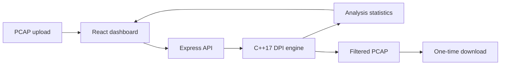

# Network Packet Analyzer

A C++17 deep packet inspection (DPI) engine with a web-based interface for analyzing PCAP network traffic. Upload a capture to inspect packet statistics, application classifications, and detected domains, then optionally apply traffic-blocking rules and download a filtered PCAP.

**Live demo:** [network-packet-analyser.onrender.com](https://network-packet-analyser.onrender.com/)

## Features

- Upload and analyze classic PCAP captures through a web dashboard
- Parse Ethernet, IPv4, TCP, and UDP traffic
- Track network flows and classify applications
- Extract TLS SNI and HTTP Host information when available
- Apply IP-, application-, and domain-based blocking rules
- View packet totals, forwarded and dropped counts, and application statistics
- Download the filtered capture as a PCAP file
- Process packets with the multithreaded C++17 DPI engine

## Architecture



## Tech stack

- **Engine:** C++17, pthreads
- **Backend:** Node.js, Express, TypeScript
- **Frontend:** React, TypeScript, Vite
- **Input format:** Classic PCAP

## Run locally

### Requirements

- Node.js and npm
- A C++ compiler with C++17 and pthread support (`g++` on Linux)

### Install and start the development server

```bash
npm ci
npm run dev
```

Open `http://localhost:5000` in your browser. The development command builds the DPI engine before starting the web app.

### Build and run in production mode

```bash
npm run build
npm start
```

The build compiles the native engine, checks and compiles the TypeScript server, and builds the frontend assets. The production server serves the built frontend and API.

To build just the engine:

```bash
npm run build:engine
```

## Use the DPI engine directly

After building the engine, run it with an input capture and an output path:

```bash
./build/dpi_engine test_dpi.pcap filtered.pcap
```

Optional rules can be repeated:

```bash
./build/dpi_engine test_dpi.pcap filtered.pcap \
  --block-ip 192.168.1.50 \
  --block-app YouTube \
  --block-domain facebook
```

## Analysis API

### `POST /api/analyze`

Accepts `multipart/form-data` with:

- `file`: the PCAP capture
- `blockIps`: optional IPv4 blocking rules
- `blockApps`: optional application-label rules
- `blockDomains`: optional domain-substring rules

The response contains the engine's analysis statistics, application and domain information, and a `downloadUrl` for the filtered capture.

### `GET /api/download/:id`

Downloads the generated PCAP. Download links are one-time use and expire after 15 minutes.

### `GET /api/health`

Returns the API health status and accepted capture limits.

## Input requirements and behavior

- Accepts classic PCAP 2.4 with Ethernet link type and microsecond timestamps. PCAPNG and nanosecond-timestamp captures are not supported.
- Maximum upload size: **25 MiB**.
- Maximum engine run time: **60 seconds**.
- Domain rules use case-sensitive substring matching.
- Application rules use exact, case-sensitive engine labels.
- The engine reports an overall dropped-packet total; it does not provide packet-drop counts for each individual rule.
- Input and temporary output files are removed after processing, download, expiry, or server restart cleanup.

## Project structure

```text
client/                 React web interface
server/                 Express API and engine orchestration
src/                    C++ DPI engine implementation
include/                C++ headers
scripts/build-engine.mjs Native engine build script
test_dpi.pcap           Sample PCAP capture
```

## Privacy and authorized use

Only analyze traffic captures you are authorized to inspect. PCAP files can contain sensitive IP addresses, hostnames, and other network data; avoid uploading sensitive captures to the public demo.

## Author

**Sejal Thakur**  
[GitHub: whilesejalcodes](https://github.com/whilesejalcodes)

For educational and authorized network-analysis purposes only.
